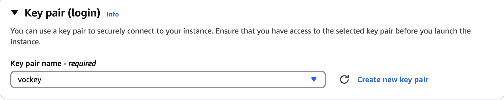
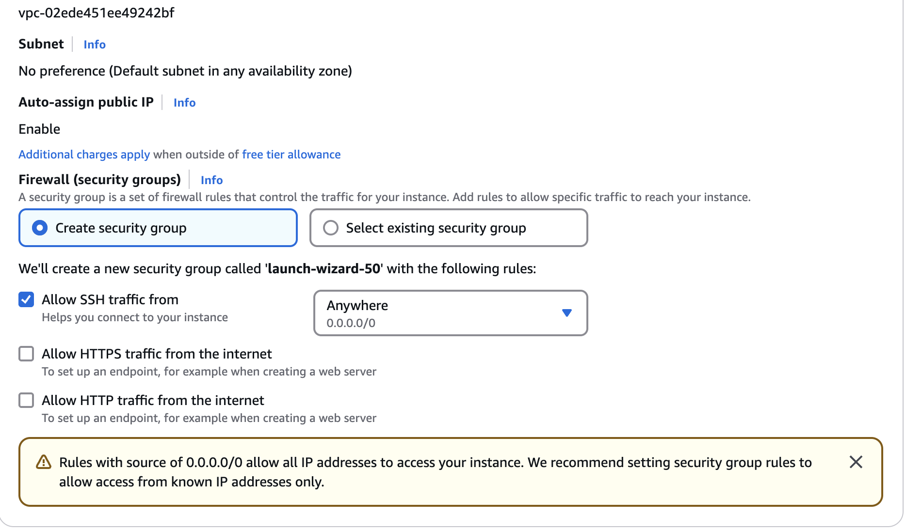
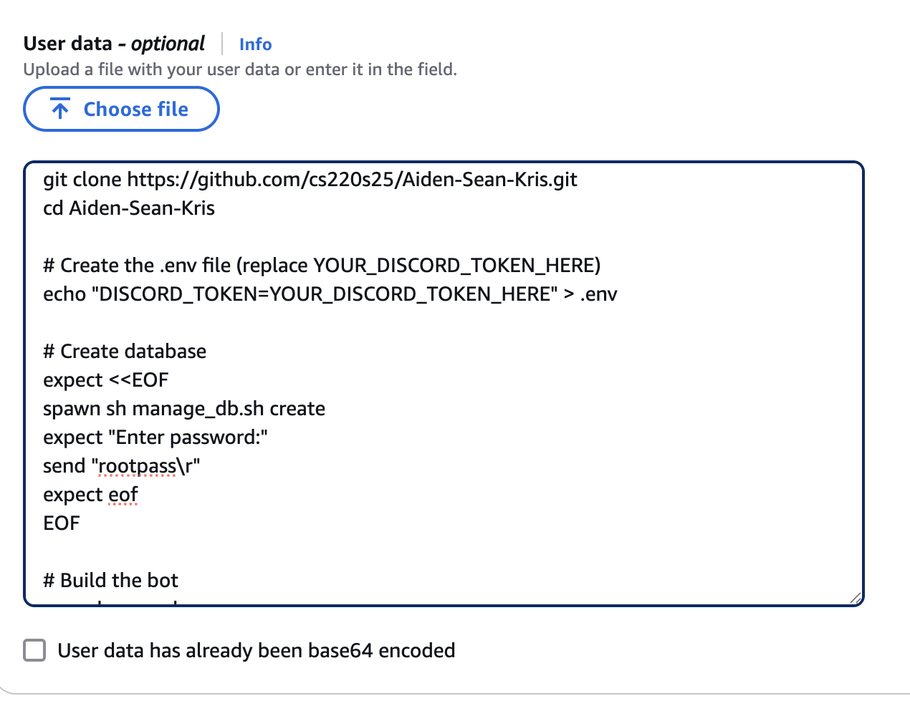
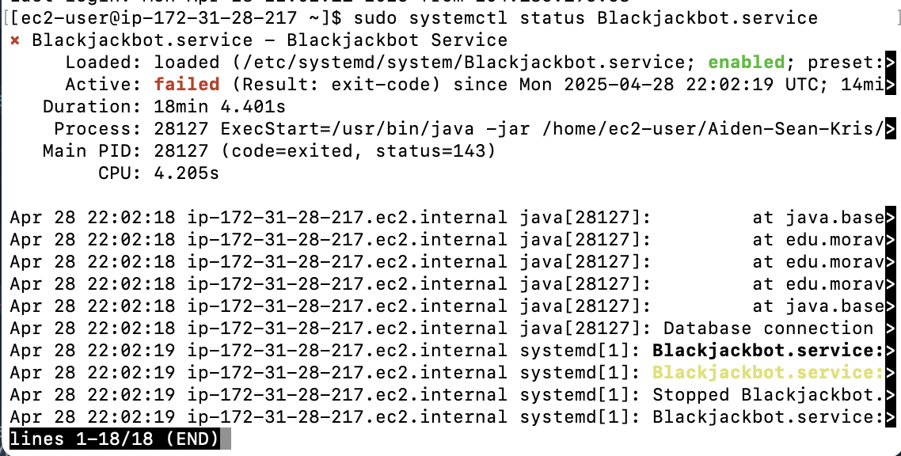
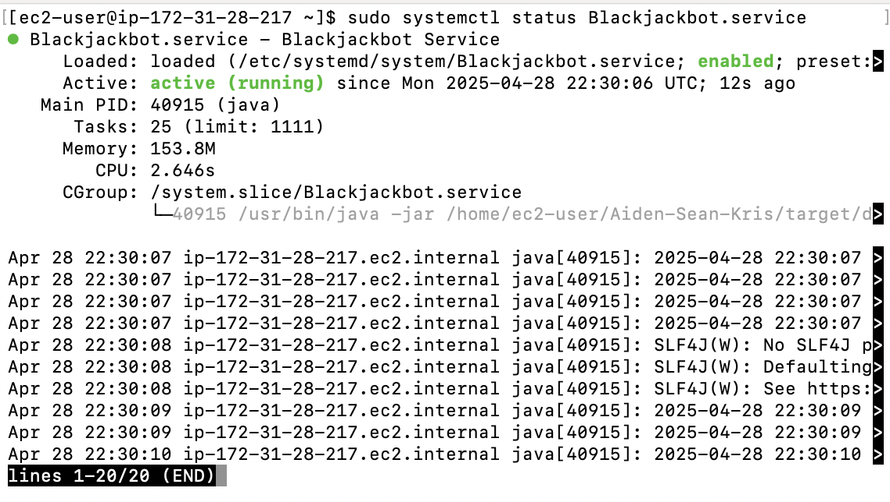
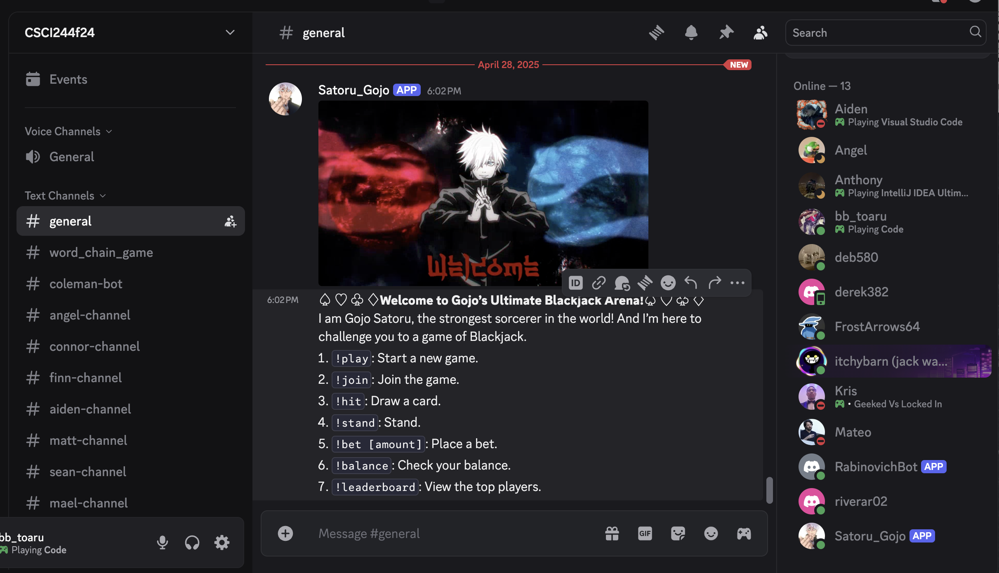
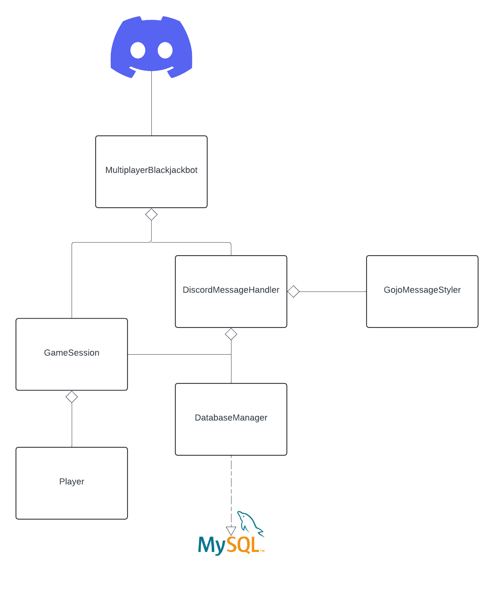

# 🎲 Gojo's Ultimate Blackjack Arena 🎲
[](https://opensource.org/licenses/AFL-3.0)
## 📋 Table of Contents
- [CI/CD Status](#-cicd-status)
- [Project Overview](#-project-overview)
- [Setup Instructions](#️-setup-instructions)
   - [Set Gojo Bot Locally](#-how-to-create-and-set-up-a-new-discord-bot-)
   - [EC2 Deployment Steps](#-ec2-deployment-steps)
   - [EC2 Docker Deployment Steps](#-ec2-docker-deployment-steps)
- [How to Play](#-how-to-play)
- [Game Mechanics](#-game-mechanics)
- [System Architecture](#-system-architecture)

## 📈 CI/CD Status

| Workflow | Status |
|:---|:---|
| Maven Build | [](https://github.com/cs220s25/Aiden-Sean-Kris/actions/workflows/maven-build.yml) |
| Deploy | [](https://github.com/cs220s25/Aiden-Sean-Kris/actions/workflows/deploy.yml) |
| Style Checker | [](https://github.com/cs220s25/Aiden-Sean-Kris/actions/workflows/style-checker.yml) |
| Docker Deployment (AWS) | [](https://github.com/cs220s25/Aiden-Sean-Kris/actions/workflows/dockerEC2Deploy.yml) |

---

## 🎮 Project Overview

**Gojo's Ultimate Blackjack Arena** brings the excitement of Blackjack into Discord servers, enhanced with Gojo Satoru’s flair!

### ✨ Features
- **Multiplayer**: Up to 8 players.
- **Persistent Economy**: Start with 40 coins and build your fortune.
- **Dynamic Betting**: Bet smart and dominate.
- **Gojo-themed Messages**: Hilarious and stylish interactions.

---

# ⚙️ Setup Instructions  
### 🎯 How to Create and Set Up a New Discord Bot 🎯  

#### Step 1: Access the Discord Developer Portal  
1. Go to the [Discord Developer Portal](https://discord.com/developers/applications).  
2. Log in with your Discord account.  

#### Step 2: Create a New Application  
1. Click the **"New Application"** button (top right).  
2. Enter a name for your application (e.g., *Gojo*).  
3. Click **Create**.  

#### Step 3: Add a Bot User  
1. In the application settings, click **"Bot"** on the left sidebar.  
2. Press the **"RESET TOKEN"** button to generate a new token.  
   - A warning will pop up: "Your bot will stop working until you update the token in your bot's code."  
   - Click **"Yes, do it!"** to confirm.  

#### Step 4: Configure the Bot Settings  
1. Copy the **Bot Token** by clicking **Copy**.  
   ⚠️ **Important:** Treat this token like a password. Do not share it publicly.  
2. Ensure the following settings are enabled:  
   - **Public Bot**: Slide the toggle to blue.  
   - **Message Content Intent**: Slide the toggle to blue.  
3. Under **Bot Permissions**, select **Administrator** and click **Save Changes**.  

#### Step 5: Set Up OAuth2  
1. Click **"OAuth2"** in the left sidebar.  
2. Under the **OAuth2 URL Generator** section:  
   - Select **"bot"**.  
   - Under **Bot Permissions**, choose **Administrator** again.  
3. Copy the **Generated URL** at the bottom of the page.  
4. Paste the URL into a new browser tab.  
5. Choose a server where you want to add the bot.  
6. Click **Continue** and then **Authorize**.

#### Step 6: Clone Repo/Make .env file
Copy and paste these steps down below in your terminal

git clone https://github.com/cs220s25/Aiden-Sean-Kris.git
cd Aiden-Sean-Kris
nano .env

Once you get into the File named **".env"** paste your private discord token after the **DISORD_TOKEN** section 

DISCORD_TOKEN=YOUR_DISCORD_TOKEN_HERE

---

### 🚀 EC2 Deployment Steps
1. **Launch an EC2 Instance** via AWS EC2 Dashboard.
2. **Key Pair**: Select `vockey` (for SSH).

3. **Security Group Rules**:
   - Allow **Port 22 (SSH)** and **Port 80 (HTTP)**.

4. **Advanced Details**:
   - Add user data from `userdata.sh`.
   - Edit your `.env`:
     ```bash
     echo "DISCORD_TOKEN=YOUR_DISCORD_TOKEN_HERE" > .env
     ```

5. **Launch Instance** — wait 2 minutes for the server to initialize.

###  🐳 EC2 Docker Deployment Steps
**While in The AWS EC2**

**1. Type in**
```bash
sudo systemctl status Blackjackbot.service
```
**1a. If Bot is stopped and systemctl shows this**

**Then You're Good! ✅**

**Now Run**
```bash
cd Aiden-Sean-Kris/
sudo sh ec2Docker/installDocker.sh
```

**1b. If bot is running and systemctl shows this**


* **Then run this**
```bash
sudo systemctl stop Blackjackbot.service
```
**Now systemctl should say this**


**Now You're Good! ✅**

**Now Run**
```bash
cd Aiden-Sean-Kris/
sudo sh ec2Docker/installDocker.sh
```

### Now Gojo is Ready to Run! 🔥


---

# 🕹️ How to Play
## Commands
| Command | Description |
|:---|:---|
| `gojo` | List available bot commands |
| `!play` | Start a new Blackjack game |
| `!join` | Join an ongoing session |
| `!bet [amount]` | Place your wager |
| `!hit` | Request another card |
| `!stand` | Hold your hand |
| `!balance` | Check your current coins |

---

## 🧩 Game Mechanics

- Start with **40 coins**.
- Place bets each round.
- Play against the dealer (Gojo!).
- **Blackjack** pays **1.5x** your bet.
- Bust (over 21) and lose your bet.

---

## 🗺️ System Architecture



### Key Components
- **Discord Message Handler**: Captures and processes user inputs.
- **Game Session Manager**: Tracks game states.
- **Database Manager**: Saves player data and balances.
- **Player Entity**: Tracks hands, bets, and balances.
- **Discord Message Manager**: Handles card operations and bot startup.
